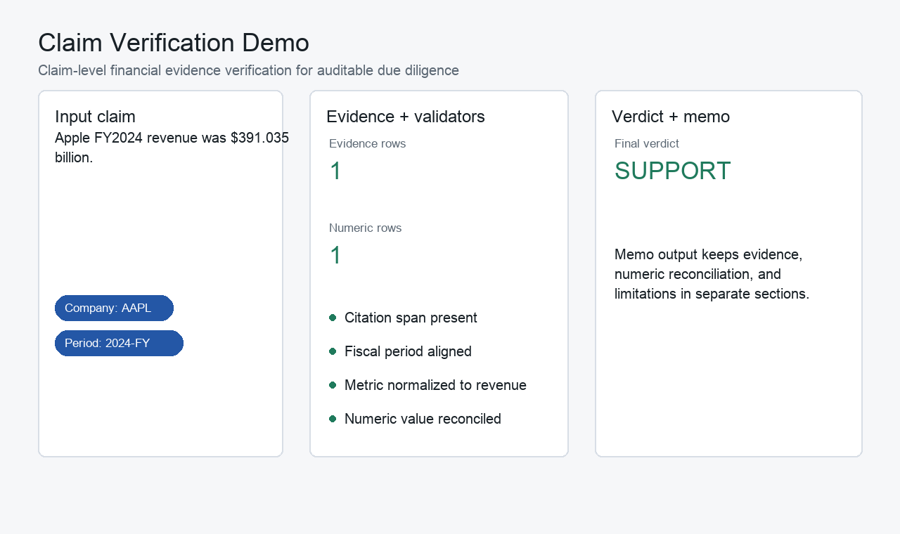
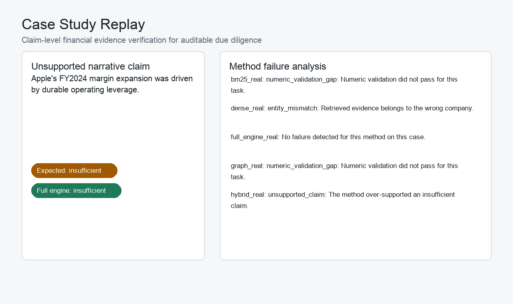
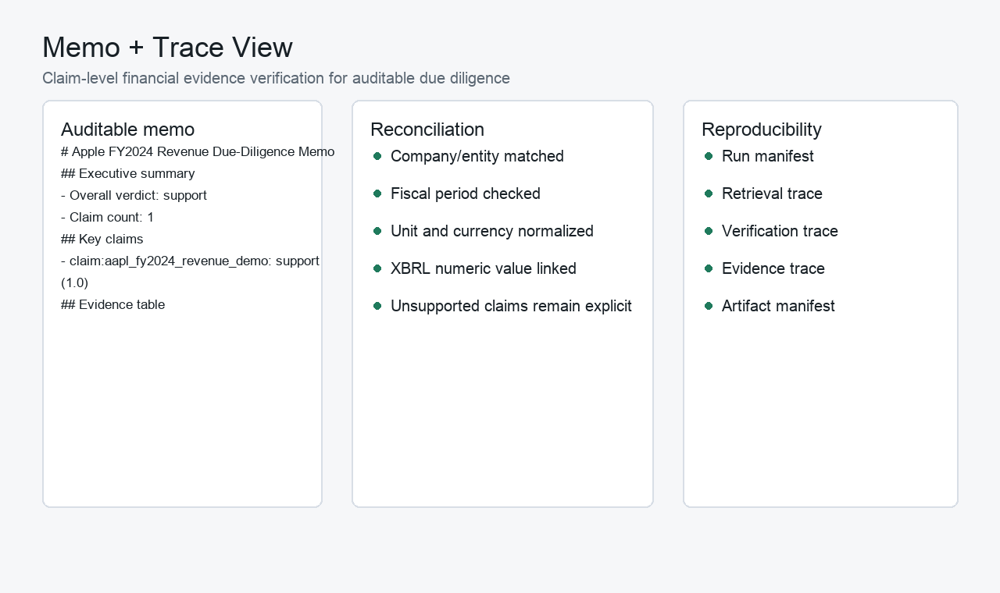
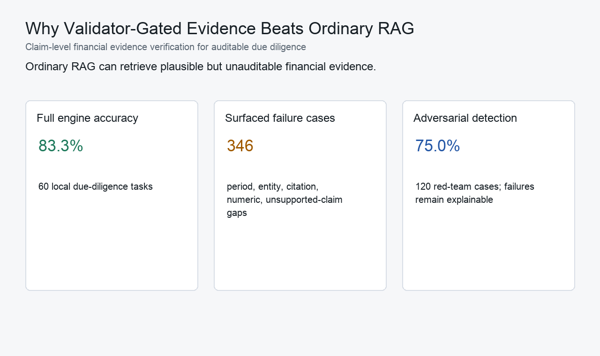

# Multimodal Financial Due-Diligence Evidence Engine

Claim-level financial evidence verification for auditable due-diligence workflows.

Ordinary RAG can retrieve plausible but unauditable evidence in financial due diligence.
This project verifies financial claims through claim decomposition, evidence graph linking, numeric reconciliation, and validator gates before generating an auditable memo.

**Portfolio entry:** [PORTFOLIO.md](PORTFOLIO.md)

Fast local demo:

```bash
make portfolio-demo
```

Expected output includes `screenshots=3`, `commands=6`, `verify_verdict=support`, `docs=6`, and `api_key_required=False`.

| Claim verification | Case-study replay | Memo and trace view |
| --- | --- | --- |
|  |  |  |



| Killer Result | Value |
| --- | ---: |
| Full engine accuracy | 83.3% |
| Surfaced retrieval/validator failure cases | 346 |
| Adversarial detection accuracy | 75.0% |

## Core Workflow

```text
financial claim
-> decompose subclaims
-> retrieve evidence
-> extract text/table/chart/XBRL support
-> normalize company, metric, period, unit, and currency
-> reconcile numbers
-> build evidence graph
-> detect unsupported or contradictory claims
-> produce auditable due-diligence memo
```

## Repository Control Files

- `AGENTS.md`: project-specific instructions for Codex and other coding agents
- `ROADMAP.md`: project phases, acceptance criteria, deferred work, and next action
- `TASK_MEMORY.md`: current status, decisions, completed work, validation results, and next steps
- `VALIDATION.md`: required validation and smoke-check commands
- `RUNBOOK.md`: common local commands and operating notes

## Current Status

The local portfolio-ready MVP, real-retrieval hardening slice, Phase 9 portfolio case studies, Phase 10 investor-deck chart extraction slice, Phase 11 raw corpus indexing slice, Phase 12 embedding/reranking backend slice, Phase 13 validator-gated LLM decomposition slice, Phase 14 narrative/causal verification slice, Phase 15 adversarial/red-team evaluation slice, Phase 16 trace/reproducibility hardening slice, Phase 17 portfolio report artifact, Phase 18 lightweight local demo UI, Phase 19 local production workflow, and Phase 20 final interview packaging are complete.

## Public Claim Boundaries

- Investor-deck evidence extraction is a narrow text-extractable PDF/chart slice, not a general visual chart parser.
- Dense retrieval defaults to a deterministic token-vector proxy; optional real embedding providers are disabled unless explicitly configured.
- The raw corpus is a local reproducible fixture with SEC-like filing paragraphs, XBRL facts, transcript chunks, and deck evidence; it is not broad SEC-scale ingestion.
- The project is a claim-level financial evidence verification system, not a generic RAG chatbot or a trained neural retrieval model.

## Data Platform View

For AI data platform roles, the same evidence engine can be presented as an
unstructured financial-document pipeline: document metadata, raw chunks,
evidence requirements, claim labels, citation coverage, and fiscal-period /
unit normalization quality checks.

- Framing doc: [data_platform_framing.md](docs/data_platform_framing.md)
- Tables: `reports/tables/document_metadata.csv`, `chunks.csv`,
  `evidence_units.csv`, `claims.csv`, `citation_coverage.csv`, and
  `normalization_quality_checks.csv`
- Build command: `python3 scripts/build_data_platform_artifacts.py`

## Portfolio Entry Points

2-minute read:

- [Interview story](docs/interview_story.md)
- [60-second pitch](docs/sixty_second_pitch.md)
- [Resume bullets](docs/resume_bullets.md)
- [Failure modes](docs/failure_modes.md)

10-minute artifact:

- [Portfolio report PDF](reports/final_report.pdf)
- [Portfolio report Markdown](reports/final_report.md)
- [Demo script](docs/demo_script.md)

30-minute reproduction:

```bash
python3 -m pytest
python3 scripts/build_portfolio_screenshots.py
python3 scripts/smoke_trace_reproducibility.py
python3 scripts/build_portfolio_report.py
python3 scripts/smoke_demo_ui.py
python3 scripts/smoke_cli_workflow.py
python3 scripts/smoke_interview_packaging.py
```

The repository now includes:

- Python project metadata in `pyproject.toml`
- the initial 3-company universe in `configs/companies.yaml`
- package layout under `src/financial_evidence_engine/`
- SEC submissions and XBRL company facts metadata registry code
- source payload cache and stable version hashes
- SEC filing section splitting
- XBRL fact extraction into evidence units
- transcript speaker/section parsing
- markdown table numeric extraction
- entity, ticker, CIK, fiscal period, metric, unit, and currency normalization
- guardrails that reject accidental company, period, frequency, metric, currency, and unreconciled scale mismatches
- typed evidence graph nodes and edges for companies, documents, fiscal periods, metrics, claims, evidence units, risk themes, speakers, segments, and events
- graph builder from `DocumentMetadata` and `EvidenceUnit`
- claim-to-evidence, metric-to-evidence, company-period, and risk-theme graph query helpers
- claim and subclaim models
- deterministic claim decomposition for simple financial numeric claims
- graph-based evidence selection
- citation, fiscal-period, source-consistency, numeric, and unsupported-claim validators
- support / contradict / insufficient verdict generation
- typed due-diligence task models for evaluation gold labels
- a 60-task seed set across 10 companies and 6 due-diligence task families
- expected evidence units, numeric checks, allowed source types, verdicts, and known distractors for each task
- deterministic evaluation metrics for evidence recall, citation exactness, numeric correctness, fiscal-period correctness, entity correctness, verdict accuracy, contradiction detection, unsupported-claim rate, answer faithfulness, memo usefulness, latency, and cost
- six diagnostic baseline profiles: BM25 RAG, dense-proxy RAG, hybrid retrieval + reranker, graph retrieval, multimodal extraction only, and full evidence engine
- six ablation profiles covering graph, numeric validator, fiscal-period validator, chart/table extraction, contradiction detector, and reranker removal
- a local real-retrieval evaluation slice over a 320-document corpus built from gold evidence specs plus known distractors
- real BM25, deterministic token-vector dense proxy, hybrid, graph-constrained, and validator-augmented retrieval runs
- failure-case surfacing for period confusion, entity mismatch, citation mismatch, numeric validation gaps, missed contradictions, unsupported claims, and chart extraction gaps
- auditable due-diligence memo generation with executive summary, key claims, evidence table, numeric reconciliation, contradictions, risk flags, unresolved issues, limitations, and traceable conclusions
- markdown serialization that separates evidence from inference
- final report packaging with chart specs, result tables, sample memo, reproducibility commands, and polished resume bullets
- portfolio case studies that turn the real retrieval failures into recruiter-facing JSON and Markdown artifacts
- a minimal investor-deck PDF/chart extraction loop for one NVDA FY2024 chart fixture
- chart evidence conversion into traceable evidence units
- chart-to-XBRL reconciliation with insufficient verdicts when chart evidence is missing
- a 482-chunk raw corpus fixture with SEC filing sections/paragraphs, XBRL facts, transcript turns, deck pages, and deck chart units
- raw chunk provenance with company, source type, document id, fiscal period, section/page, text span, and stable hash
- retrieval evaluation corpus selection for `benchmark` versus `raw` corpus modes
- pluggable embedding providers with deterministic offline default and optional local/live backends
- cached embedding index manifests
- metadata reranker interface and Phase 12 method report separating `dense_proxy` from optional `dense_real`
- validator-gated LLM claim decomposition interfaces
- recorded offline LLM decomposition fixtures for 5 complex financial claims
- schema validation for recorded LLM decomposition output
- entity, fiscal-period, and metric validator gates that reject hallucinated LLM subclaims
- rule-based versus recorded-LLM decomposition comparison artifacts
- an optional live LLM decomposer placeholder that is disabled by default and never required by tests
- narrative and causal claim verification with partial verdicts
- 10 narrative/causal due-diligence tasks covering numeric trends, segment contribution, causal attribution, management guidance, risk-factor changes, and deck narratives
- memo sections that separate evidence-supported numeric trends, inference, and unsupported causal attribution
- ordinary RAG overclaim reporting for causal/narrative failure cases
- adversarial/red-team task generation with 120 tasks across 12 failure modes
- failure-mode taxonomy and validator coverage matrix
- explainable failure reasons without requiring perfect full-engine accuracy
- SQLite-backed trace store with run, retrieval, verification, evidence, memo, and artifact manifests
- reproducibility trace artifacts for the three portfolio case studies
- case-study regeneration from trace records
- portfolio-ready report generator with Markdown, PDF, figure specs, table specs, resume bullet, and manifest artifacts
- lightweight local Streamlit demo over existing artifacts
- local claim-verification demo path that requires no API key
- `financial-evidence` CLI commands for local verification, corpus, evaluation, case-study, report, and demo workflows
- offline config profiles, structured error taxonomy, artifact versioning, cache invalidation plans, and provenance checks
- final interview story, resume bullets, system design notes, failure-mode guide, and demo script
- Phase 0 through Phase 20 tests under `tests/`

The roadmap is complete through Phase 20. The default dense retrieval path remains an offline deterministic token-vector proxy; real embedding and live LLM providers are optional and skipped gracefully when unavailable.

## Portfolio Case Studies

| Case | Failure mode | Claim | Full-engine verdict | Artifact |
| --- | --- | --- | --- | --- |
| `fiscal_period_confusion` | `period_confusion` | Apple's FY2024 revenue grew versus FY2023. | `support` | [Markdown](reports/case_studies/fiscal_period_confusion.md) |
| `numeric_unit_mismatch` | `numeric_validation_gap` | Apple's FY2024 operating margin exceeded Microsoft's FY2024 operating margin. | `support` | [Markdown](reports/case_studies/numeric_unit_mismatch.md) |
| `unsupported_narrative_claim` | `unsupported_claim` | Apple's FY2024 margin expansion was driven by durable operating leverage. | `insufficient` | [Markdown](reports/case_studies/unsupported_narrative_claim.md) |

See `ROADMAP.md` and `TASK_MEMORY.md` before starting work.

## LLM Decomposition Slice

Phase 13 keeps rule-based decomposition as the default, adds recorded LLM outputs as deterministic offline fixtures, and gates all LLM-generated subclaims through schema, entity, fiscal-period, and metric validation.

- JSON artifact: `experiments/llm_decomposition/phase13_decomposition_comparison.json`
- Markdown artifact: [phase13_decomposition_comparison.md](reports/llm_decomposition/phase13_decomposition_comparison.md)

## Narrative / Causal Verification Slice

Phase 14 prevents numeric or management-language support from being over-read as causal proof. It adds partial verdicts such as `support_numeric_only`, `support_narrative`, `contradict_numeric`, `contradict_narrative`, and `insufficient_causal_support`.

- JSON artifact: `experiments/narrative_causal/phase14_narrative_causal_report.json`
- Markdown artifact: [phase14_narrative_causal_report.md](reports/narrative_causal/phase14_narrative_causal_report.md)

## Red-Team Summary

Phase 15 adds adversarial evaluation instead of chasing perfect accuracy. The report contains 120 tasks across 12 failure modes, maps each mode to a validator owner, and keeps missed hard cases explainable.

- JSON artifact: `experiments/adversarial/phase15_adversarial_report.json`
- Markdown artifact: [phase15_adversarial_report.md](reports/adversarial/phase15_adversarial_report.md)

## Reproducibility Trace

Phase 16 records the case-study runs in a local SQLite trace store. Each run keeps a config hash, corpus version, method, task id, retrieved chunks, validator results, final verdict, runtime, and artifact paths.

One-command trace reproduction:

```bash
python3 scripts/smoke_trace_reproducibility.py
```

- SQLite trace DB: `experiments/traces/phase16_trace.sqlite`
- Artifact manifest: `reports/traces/phase16_artifact_manifest.json`

## Portfolio Report

Phase 17 builds the recruiter-facing technical artifact.

```bash
python3 scripts/build_portfolio_report.py
```

- PDF: [final_report.pdf](reports/final_report.pdf)
- Markdown: [final_report.md](reports/final_report.md)
- Manifest: `reports/portfolio_report_manifest.json`
- Resume bullet: `reports/resume_bullet.txt`

## Local Demo

Phase 18 adds a local demo UI over checked-in artifacts. It has four views: claim verification, case study browser, retrieval method comparison, and memo view.

```bash
python3 -m streamlit run app.py
```

Offline smoke checks:

```bash
python3 scripts/smoke_demo_ui.py
python3 scripts/smoke_streamlit_start.py
```

## Local CLI

Phase 19 adds a production-oriented local CLI.

```bash
PYTHONPATH=src python3 -m financial_evidence_engine.cli --help
PYTHONPATH=src python3 -m financial_evidence_engine.cli verify-claim --claim "Apple FY2024 revenue was $391.035 billion."
```

Smoke check:

```bash
python3 scripts/smoke_cli_workflow.py
```

## Interview Package

Phase 20 packages the project for applications and interviews.

- [Interview story](docs/interview_story.md)
- [Resume bullets](docs/resume_bullets.md)
- [System design notes](docs/system_design_notes.md)
- [Failure modes](docs/failure_modes.md)
- [Demo script](docs/demo_script.md)

```bash
python3 scripts/smoke_interview_packaging.py
```
